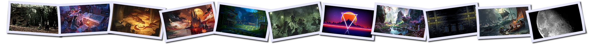

<!--
make sure you're editing the template, doofus
-->

# 3,495 Wallpapers

A simple repo to house my wallpapers for ease of use and automation.

# Table of Contents
- [mobile](/mobile/README.MD) - 2,056
- [desktop](/desktop/README.MD) - 677
- [terminal](/terminal/README.MD) - 509
- [floaters](/floaters/README.MD) - 250

# Usage

## Nab Individual Wallpapers

Long press / right click > save link. Just don't save the thumbnail by mistake!

## One Big Zip File

You can always download everything as [one big zip file](https://github.com/buckmanc/wallpapers/archive/refs/heads/main.zip)

## Regular Clone

If you're a Git user and you have no storage concerns, just clone the whole thing. Otherwise, here are details on [more storage efficient options](https://github.com/buckmanc/gallery_maker?tab=readme-ov-file#shallow-clone)

# Attribution

I've added attribution where I can. Feel free to contact me or submit a pull request to add missing attribution.

# Aesthetic Decisions

- **Desktop/homescreen: chill**
  - Calming, spacious designs to underly busy windows and icons
- **Lockscreen: exciting**
  - Anything goes
  - Better with a neat and tidy lock screen
    - Samsung Galaxy users can use [LockStar](https://galaxystore.samsung.com/detail/com.samsung.systemui.lockstar) to keep things clean
- **Floaters**
  - To be centered on the screen
  - Usually t-shirt designs
- **Terminal: elegant and subdued**
  - Extremely simple, standardized designs on the opposite side from the text

# Links

- made with [Gallery Maker](https://github.com/buckmanc/gallery_maker)
- [wallpapers.buckman.cc](https://wallpapers.buckman.cc)
- [on github](https://github.com/buckmanc/wallpapers)

# Shoutouts

Thanks to [jonascarpay](https://github.com/jonascarpay/wallpapers), [makccr](https://github.com/makccr/wallpapers), and [dharmx](https://github.com/dharmx/walls) for excellent examples of wallpaper repos, all the artists of various kinds for their work, and you as Mega Man X!
